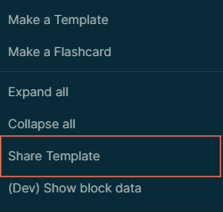

# Logseq Template Gallery

Logseq Template Gallery is plugin for [Logseq](https://www.logseq.com) that allows users to share templates they find useful with other members of the community.

You can install the plugin through the Plugin Marketplace in Logseq.

To open the gallery, click the template gallery icon in the toolbar.  In the window that appears you can discover and download templates that you find useful.

To share a tempalte, right-click the block containing the template and choose Share Template from the menu that appears.  

